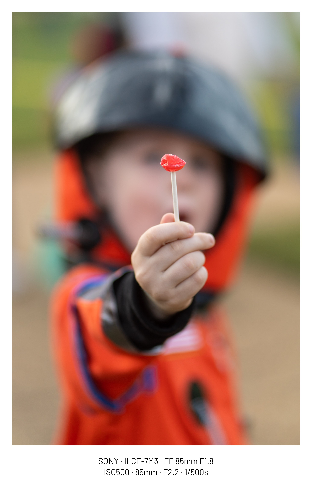
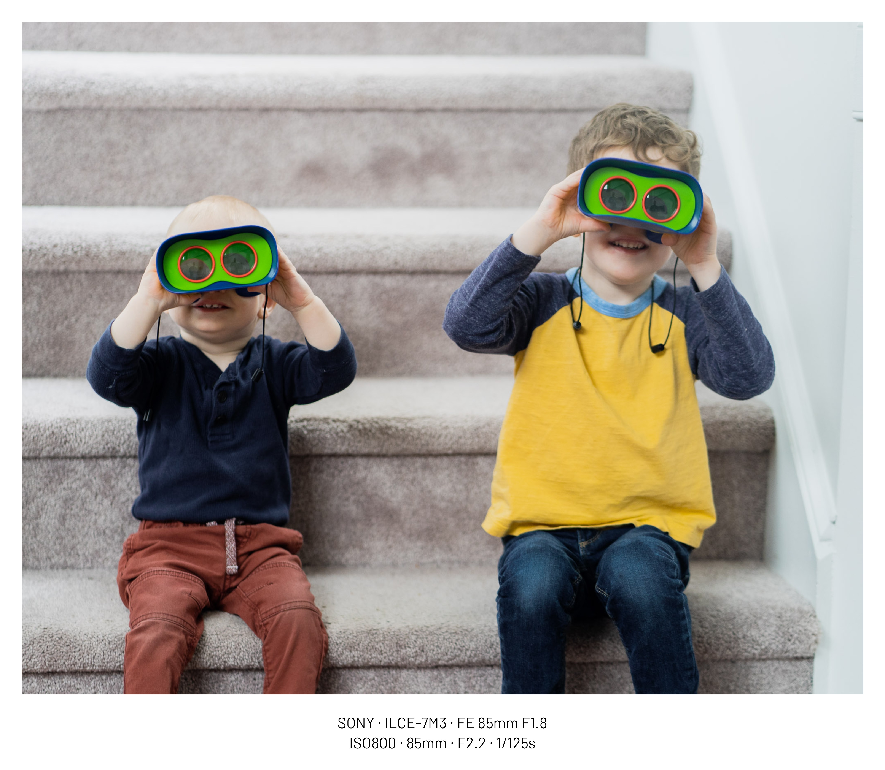
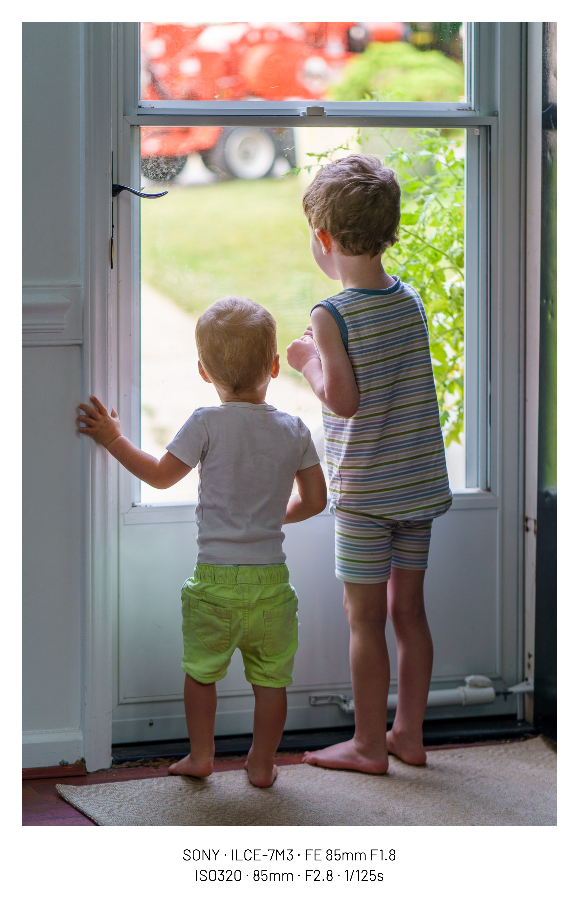
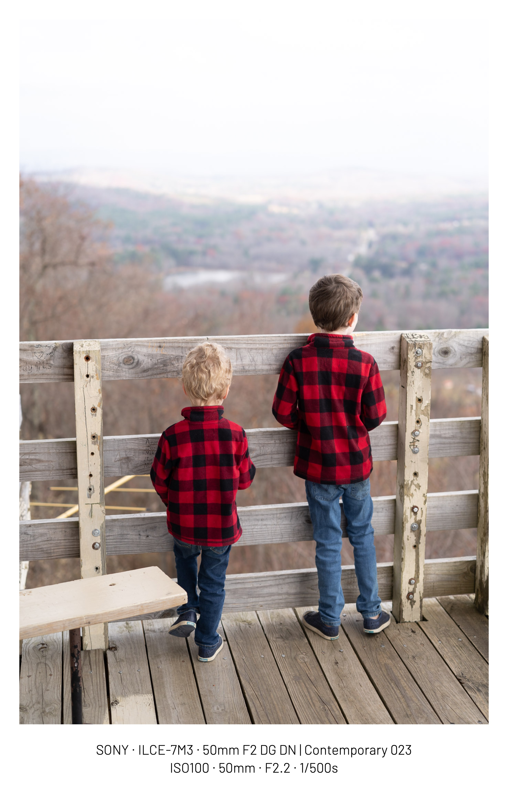
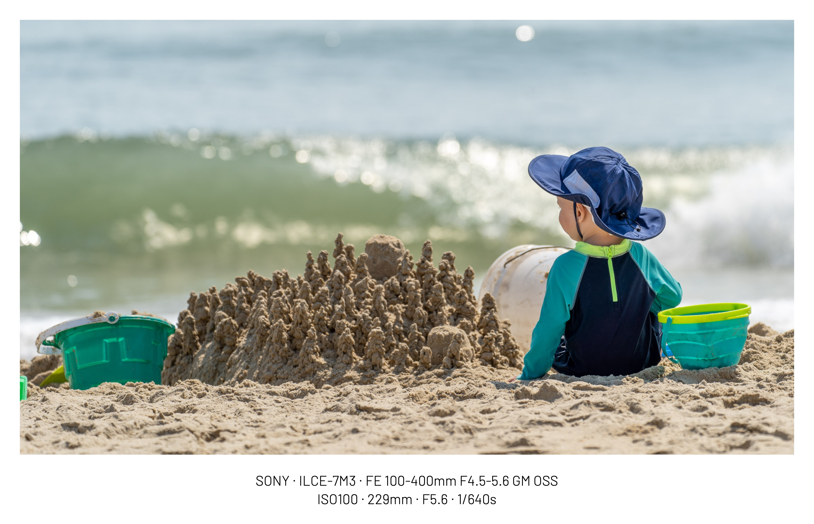
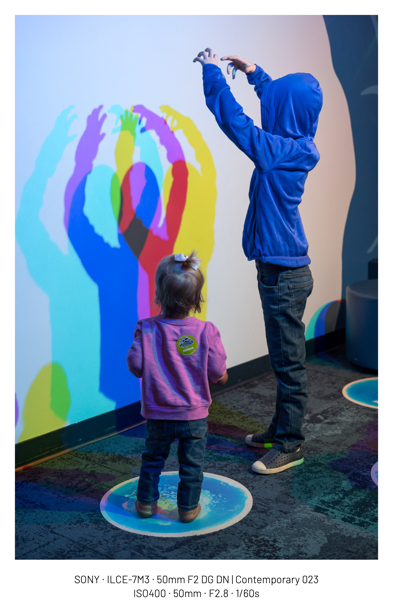
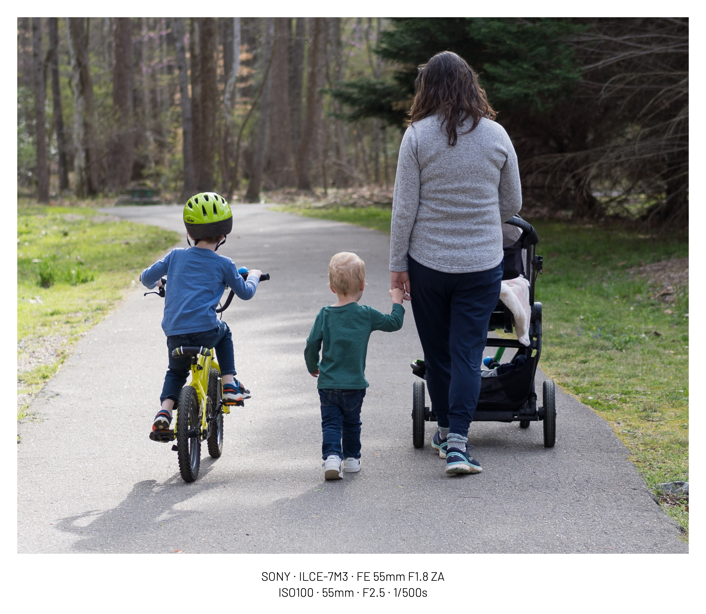
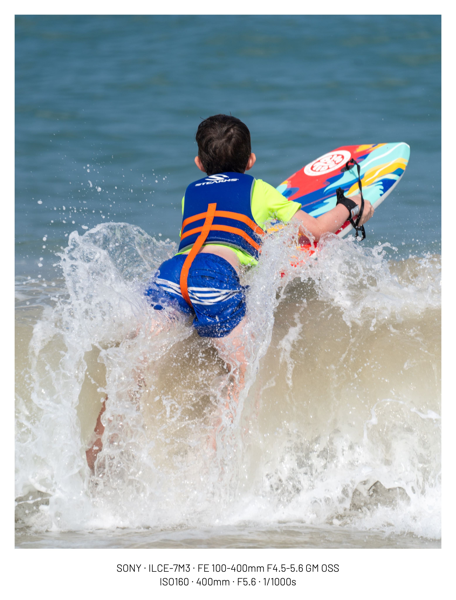
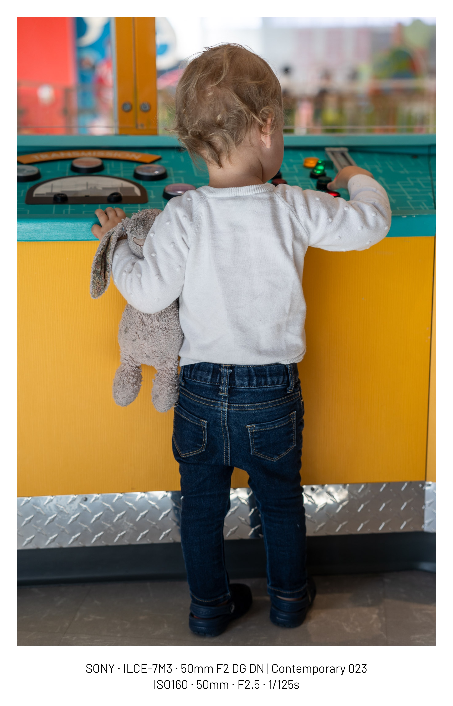

Over the last 10 years, I've become more interested in the art of photography. What
started with me try to get better photographs of waterfalls than I could with my iPhone
five has led to an era where I mostly photograph my four children (ages one to seven).

I've used a lot of different cameras over the years[^1], but the one that has consistently
brought me the most joy and satisfaction is my Sony a7 III. I've had the camera for five
years, and it
consistently helps me make delightful and beautiful images of my kids that I will
cherish for the rest of my life.

When my second child was almost due, some friends gave me money as a gift, and I used
that to move from my a6500 setup to a used Sony a7 III. While it isn't the camera I use
the most since my iPhone de jour is always closest at hand, I'm always glad to have
pulled it out. While modern iPhones have incredible cameras that make beautiful images
in the right conditions, the conditions I'm photographing my kids in are rarely ideal,
and the photos I take with my iPhone often disappoint me with their lack of sharpness,
motion blur, and lack of subject separation.

My full-frame Sony mirrorless, on the other hand, rarely disappoints.

  

## Fast and Responsive

When I'm not photographing my kids, my other main photography interest is [wildlife](https://photos.tdhopper.com/great-blue-herons).
Wildlife photography presents a unique set of challenges - conditions are rarely ideal,
and subjects move unpredictably. As a wildlife photographer, I'm constantly pursuing
what Jay Maisel calls [Gesture, Light, and Color](https://www.jaymaisel.com/products/light-gesture-and-color) in his book. You have to stay ready,
alert to fleeting opportunities.

Photography kids is exactly the same.

Having a fast and responsive camera isn't everything - the tool doesn't make the art -
but it opens doors to capturing those precious moments that might otherwise slip away.
The Sony a7 III excels in this regard in several key ways:

First, it boots almost instantly. While many cameras need several seconds to wake up, my
Sony (like other prosumer/professional cameras) is ready to shoot the moment I flip the
switch. This responsiveness has saved countless shots that slower cameras would have
missed. The quick recovery from sleep mode is equally valuable.

Beyond pure speed, the camera's physical controls are thoughtfully designed for rapid
adjustments. When shooting in aperture priority mode, I can quickly dial in aperture and
exposure compensation. If I need to freeze fast action, switching to shutter priority
and adjusting speed happens in seconds. The customizable buttons let me access my
most-used settings without diving into menus.

## Amazing Autofocus

Another aspect of speed is the camera's autofocus. Because my kids are on the move, I
almost always shoot in continuous autofocus. The face detection does a great job keeping
track of my kids, and I consistently get sharp images. Autofocus tends to be great on
modern cameras, but I love having a camera where it excels. 

The camera also also has eye detection autofocus, though it requires pressing a separate
button unlike more modern cameras. I have my AEL button set to eye autofocus, and I
instinctively press it when trying to get a portrait.

Autofocus is one area where cameras are improving every generation, and I look forward to
benefiting from that next time I upgrade 

## Large Sensor

Unlike all the other cameras I've used, the Sony a7 III is a full-frame camera. This
large sensor allows the camera to capture more light and produce cleaner images in low
light settings. While my iPhone often disappoints indoors and in the evenings, my
Sony--especially paired with a fast prime lens--consistently produces sharp and
beautiful images, even at ISO 
12800. 

The large sensor also allows for more subject separation (bokeh) than smaller sensors.
When I'm photographing my kids, I often want to blur the background to make the subject
stand out. The Sony a7 III does this beautifully. 

   

## Durable and Reliable

The Sony a7 III is a professional-grade camera. It's built to last. While I try not to
abuse it, it's been banged around on hikes, sandy at the beach, and bounced around in my
backpack. Over five years later, you'd have no idea other than some surface wear on the
body. 

Because the camera is weather-sealed, I can take it out in the rain or snow without
worrying about damaging it. Last week, I took my five year old out in freezing rain and
snow and was able to capture a few beautiful (low-light!) images of him. When I came
home, I just wiped the camera down with a towel and didn't have to worry about it.

The camera also has excellent battery life, unlike some compact and mirrorless cameras 
I've used. The battery lasts for hundreds of shots, and I can go weeks without charging it. 
I almost never have a trip or outing that requires charging. With a USB-C port, the 
camera is easy to charge whenever I need to.  

## Image Quality

The Sony a7 III produces beautiful images. The colors are vibrant, the images are sharp,
and the dynamic range is excellent. The camera produces images that are a joy to look at
and share. Without fail, my favorite photos of my kids are the ones I've taken with my
Sony.

## Silent Shooting

A small benefit of the mirrorless design is the ability to shoot totally silently. 
This isn't a feature I knew I wanted, but it has been valuable on many occasions. 
Sometimes when photographing kids, it's helpful to be able to take a photo without
them knowing. 

   

## Conclusion

Capturing the fleeting moments of my children's life is a joy and a privilege. Like most
parents of our age, I mostly use my iPhone to capture these moments. However, almost
without exception,
the photos I take with my Sony a7 III are the ones I cherish the most. The camera is
fast, responsive, and reliable. It produces beautiful images that I will keep looking at
for the rest of my life.

[^1]: Cameras I've used since 2014: iPhones from 5 up to 16 Pro Max, [Olympus Tough TG-3](https://www.dpreview.com/products/olympus/compacts/oly_tg3), [Sony NEX-5T](https://www.dpreview.com/products/sony/slrs/sony_nex5t), [Canon 7D II](https://www.dpreview.com/reviews/canon-eos-7d-mark-ii), [Sony a6500](https://www.dpreview.com/reviews/sony-alpha-a6500), [Sony RX100V](https://www.dpreview.com/reviews/sony-cybershot-dsc-rx100-v-review), [Fuji X100V](https://www.dpreview.com/reviews/fujifilm-x100v-review), [Sony a7 III](https://www.dpreview.com/reviews/sony-a7-iii-review)
