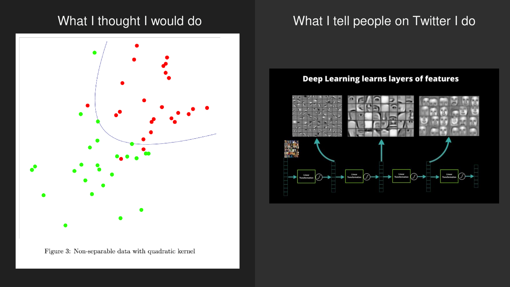
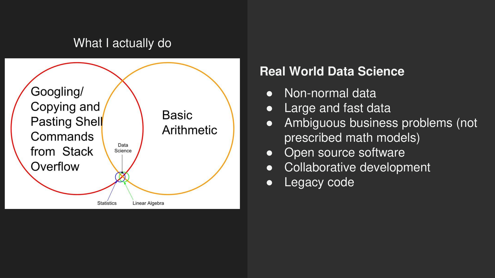

[View Slides](https://docs.google.com/presentation/d/1_wdSh2PFxiqBegt5PcatbEiQaganlgdb5bH7V2jHXZI/edit?usp=sharing)

Here's my favorite section from the talk:

I conclude by listing things I learned in school but don't use every day:

* Linear Algebra
* Probability
* Statistics
* Machine Learning
* Math Modeling
* Data Structures
* Algorithms
* Distributed Systems

And things I wasn't taught in school but use daily:

* Communication
* Careful Thought
* Prose Writing Skill
* Software Writing Skill
* Software Engineering
* Tenacity
* Stack Overflow
